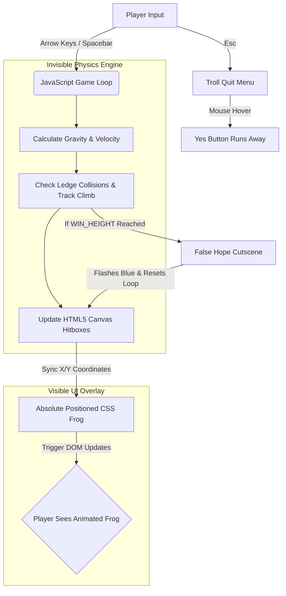

# [Kinattile Thavala 🐸 🎯] 🎯


## Basic Details
### Team Name: [zebloski]


### Team Members
- Team Lead: [Jerin Joseph] - [Mar Baselios Christian College of Engineering and Technology]
- Member 2: [Sharon Philip] - [Mar Baselios Christian College of Engineering and Technology]


### Project Description
[An infinitely looping, psychologically frustrating web game built using vanilla HTML, CSS, and JS about a frog trying to escape a well, only to realize the "real world" is just another well.]

### The Problem (that doesn't exist)
[Gamers have entirely too much hope and self-esteem. They inherently believe that if they just try hard enough and reach the top, they will win, escape their current circumstances, and finally be allowed to quit.]

### The Solution (that nobody asked for)
[A literal digital translation of a Malayalam *pazhamchollu* (proverb) that completely shatters player morale. The game forces players to climb an infinite well, gives them a "Sky Blue" false hope cutscene upon reaching the top, and drops them into a new well. To ensure maximum uselessness, the "Yes" quit button physically runs away from their mouse cursor so they are trapped in the loop.!]

## Technical Details
### Technologies/Components Used
For Software:
- [HTML5, CSS3, Vanilla JavaScript (ES6)]
- [None (Zero-dependency architecture)]
- [none]
- [VS Code, Git, GitHub Pages]

For Hardware:
- [N/A]
- [N/A]
- N/A]

### Implementation
For Software:
# Installation
[```bash
git clone [https://github.com/your-username/useless-frog-game.git](https://github.com/your-username/useless-frog-game.git)
cd useless-frog-game]

# Run
[# This project requires no build tools or package managers.
# 1. Navigate to the project folder.
# 2. Simply double-click index.html to open it in any modern web browser.
#    (Alternatively, open the folder in VS Code and use the "Live Server" extension).]

### Project Documentation
For Software:

# Screenshots (Add at least 3)

*The starting point of the game where the frog begins its infinite climb up the procedurally generated ledges inside the dark well.*


*The 'False Hope' prompt that appears after reaching the top, before dropping the player into a newly colored, identical well loop.*


*The psychological warfare exit screen triggered by the Esc key, where the 'Yes' button actively evades the user's mouse cursor to prevent them from quitting (unless they use the secret Alt+Esc override).*

# Diagrams
# Diagrams


### Project Demo
# Video
[Add your demo video link here]
*Explain what the video demonstrates*

# Additional Demos
[Add any extra demo materials/links]

## Team Contributions
- [jerin joseph]: [Core game loop logic, HTML5 Canvas physics implementation, DOM overlay integration, and project deployment.]
- [sharon philip]: [ HTML5 Canvas physics implementation, DOM overlay integration, and project deployment]

---
Made with ❤️ at TinkerHub Useless Projects 


